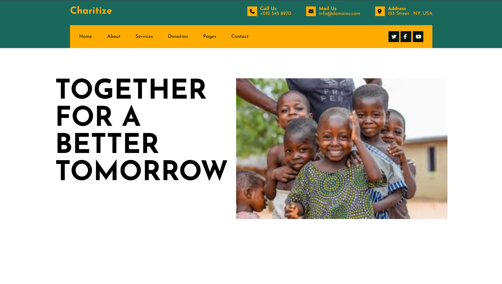

## Date: 03 March, 2026 - Tuesday

## Topics:
- To make a Website

---

### 1. To make a Website
- Today only just make a websites for practices in the classes.
- Here is the project link: `https://themewagon.github.io/Charitize/` Or [Visit](https://themewagon.github.io/Charitize/)
- Here is the project file: `index.html`

---

## 📌 Project Overview
This is a normal basic website to develop with HTML and CSS only.  
The purpose of this project is to develop my HTML and CSS coding skills better.

---

## ✨ Features
- Main navbar into sub navbar
- Navbar social media links
- Dynamic content in main part

---

## 📂 Project Structure
```
charitize/
│── images/
    └── children.png
│── index.html
│── style.css

```

## 📸 Screenshot
<p align="center">
  
</p>

---

⭐ If you like this project, feel free to give it a star!