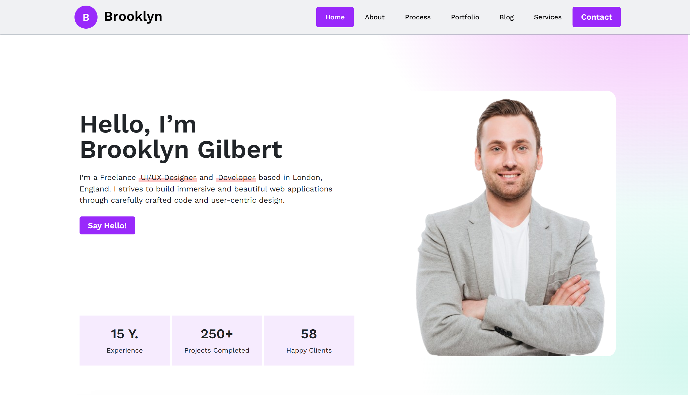
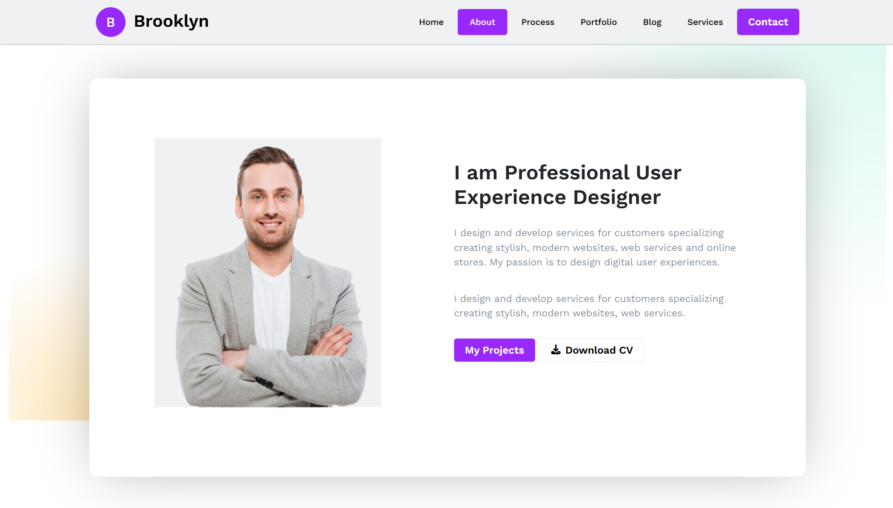

## Date: 10 March, 2026 - Tuesday

## Topics:
- To make a Website

---

### 1. To make a Website
- Today only just make a websites for practices in the classes.
- Here is the project link: `https://themewagon.github.io/picto/` Or [Visit](https://themewagon.github.io/picto/)
- Here is the project file: `index.html`

---

## 📌 Project Overview
To develop and making this websites using with **Bootstrap**.  
The purpose of this project is to develop my Bootstrap skills better.

---

## ✨ Features
- Dynamic multiples cards
- Using different types of carousel
- Contact form

---

## 📂 Project Structure
```
picto-personal-portfolio/
│── images/
    └── person.png
│── index.html
│── style.css

```

## 📸 Screenshot
<p align="center">
  
  
</p>

---

⭐ If you like this project, feel free to give it a star!