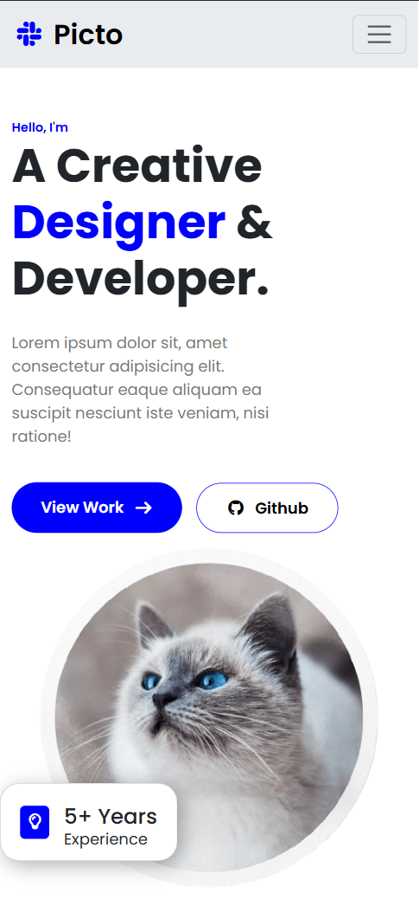
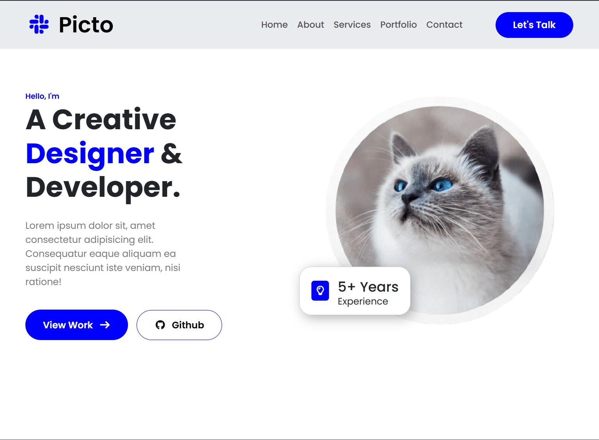
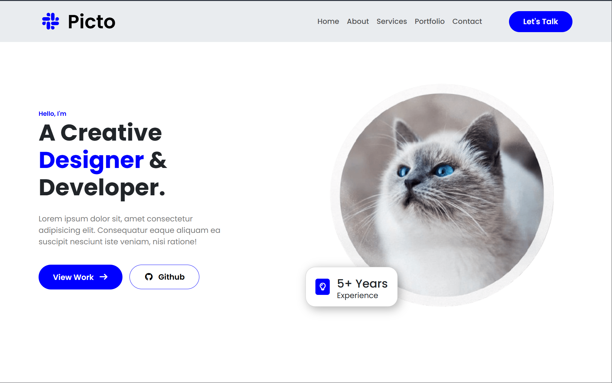

## 🗓️ Date: 29 March, 2026 - Sunday

## 📚 Topics:

- Recap previous HTML, CSS & Bootstrap
- Make a header section with Bootstrap

---

### 1. Recap previous HTML, CSS & Bootstrap

- `HTML` - Hypertext Markup Language:
  - `Canvas`
  - `SVG`
  - `Video`
  - `Audio`
  - `Plug-ins`
  - `YouTube`
  - `Form`
  - `Input`
  - `Label`
  - `Text`
  - `Select`
  - `Option`
  - `Textarea`
  - `Radio`
  - `Checkbox`
  - `Uploader`
  - `Button`
  - `Legend`

- `CSS` - Cascading Style Sheets:
  - `Box Model`
  - `Position`
  - `Transitions`
  - `Transform`
  - `Animation`
  - `Gradients`
  - `Responsive Layout`
  - `CSS Grid`
  - `CSS Flex-box`

- `Bootstrap` - CSS Framework:
  - `Layout`
  - `Content`
  - `Forms`
  - `Components`
  - `Helpers`
  - `Utilities`
  - `Extend`

---

### 2. Make a header section with Bootstrap

- `Files`:
  - `assets/`
    - `images/`
  - `index.html`
  - `style.css`

## 📸 Screenshots:

  <h4>1. Phone Screen:</h4>
  

  <h4>2. Tab Screen:</h4>
  

  <h4>3. Laptop or Desktop Screen:</h4>
  

