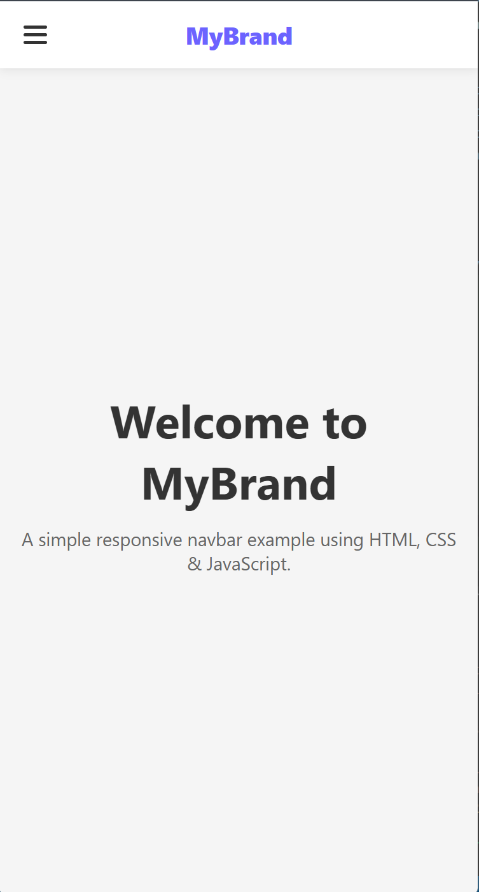

## Date: 09 April, 2026 - Thursday

## Make Navbar with RAW CSS and RAW JavaScript

Make this navbar with RAW HTML, RAW CSS and Vanilla JavaScript.

## 🛠️ Tech Stack

- **HTML:** Semantic structure.
- **CSS:** Responsive and colorful.
- **JavaScript:** DOM manipulation and intervals.

## 📂 Project Structure

```text
navbar-with-js/
├── README.md           # Project documentation
└── index.html          # HTML code + Bootstrap
└── script.js           # JavaScript program
└── style.css           # CSS code
```

## 🖼️ Preview

<p align="center">
  <h4>1. Phone Screen:</h4>
  
</p>
<p align="center">
  <h4>2. Desktop Screen:</h4>
  
</p>
