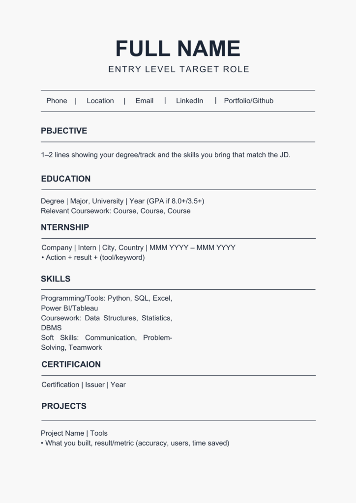

## Date: 15 April, 2026 - Wednesday

## Topics:

- Recap previous Quiz' and new somethings
- Make resume with MS Word

---

### 1. Recap previous Quiz' and new somethings

- Check this previous quiz' in **Class-29**
- Here is new somethings:
  - [NSDA Level 3 - 50 MCQ](https://eshikhon.com.bd/quiz/web-design-and-development-for-freelancing-nsda-level-3/)
  - [MS Word MCQ](https://www.sanfoundry.com/ms-office-mcq-multiple-choice-questions/)
- **pdf:** this folder have to html short questions and css mcq.

---

### 2. Make resume with MS Word

- Here is resume demo:
  

- Here is resume templates:
  
  - [Resume Video Link - Click here](https://resumesector.com/best-resume-template/)

- This is a **ATS Resume**:
  
