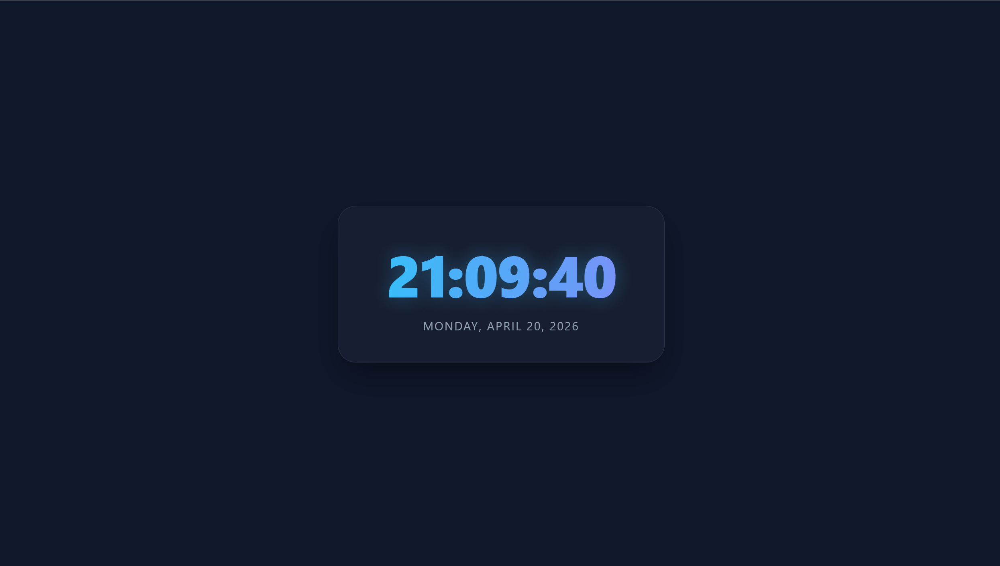

## Date: 16 April, 2026 - Thursday

# 🕒 Modern Digital Clock

Make this project with Raw HTML5, Raw CSS3 and Vanilla JavaScript.

## 🛠️ Tech Stack

- **HTML5:** Semantic structure.
- **CSS3:** Flexbox, linear gradients, and Colorful.
- **JavaScript (ES6):** DOM manipulation and intervals.

## 📂 Project Structure

```text
modern-digital-clock/
├── README.md           # Project documentation
└── index.html          # HTML code
└── script.js           # JavaScript program
└── style.css           # CSS code
```

## 🚀 Live Preview

- **Real-Time Display:** High-accuracy time tracking.
- **Colorful UI:** Frosted glass effect with CSS backdrop filters.
- **Responsive:** Works perfectly on mobile, tablet, and desktop.

## 🖼️ Preview

