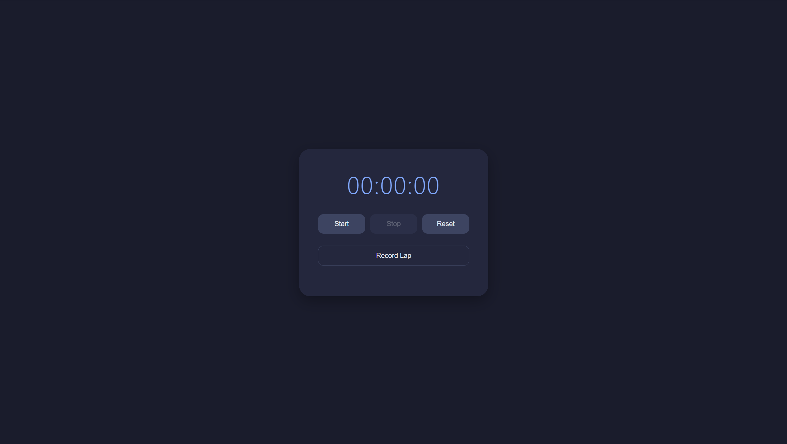

## Date: 20 April, 2026 - Monday

# 🕒 Neon Emerald Stopwatch

Make this project with Raw HTML5, Raw CSS3 and Vanilla JavaScript.

## 🛠️ Tech Stack

- **HTML5:** Semantic structure.
- **CSS3:** Attractive and colorful.
- **JavaScript (ES6):** DOM manipulation and intervals.

## 📂 Project Structure

```text
neon-emerald-stopwatch/
├── README.md           # Project documentation
└── index.html          # HTML code
└── script.js           # JavaScript program
└── style.css           # CSS code
```

## 🖼️ Preview


