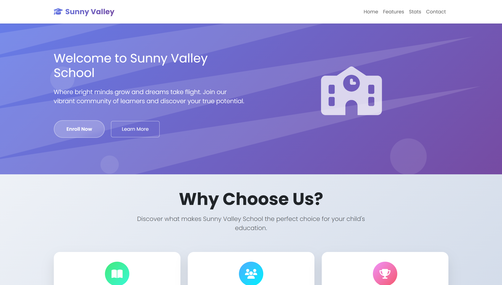

## Date: 21 April, 2026 - Tuesday

# 🏫 Sunny Valley School

Make this project with HTML, Bootstrap and Vanilla JavaScript.

## 🛠️ Tech Stack

- **HTML:** Semantic structure.
- **Bootstrap:** Faster, easier, and consistently responsive.
- **JavaScript:** DOM manipulation and intervals.

## 📂 Project Structure

```text
sunny-valley-school/
├── README.md           # Project documentation
└── index.html          # HTML code + Bootstrap
└── script.js           # JavaScript program
└── style.css           # CSS code
```

## 🖼️ Preview

