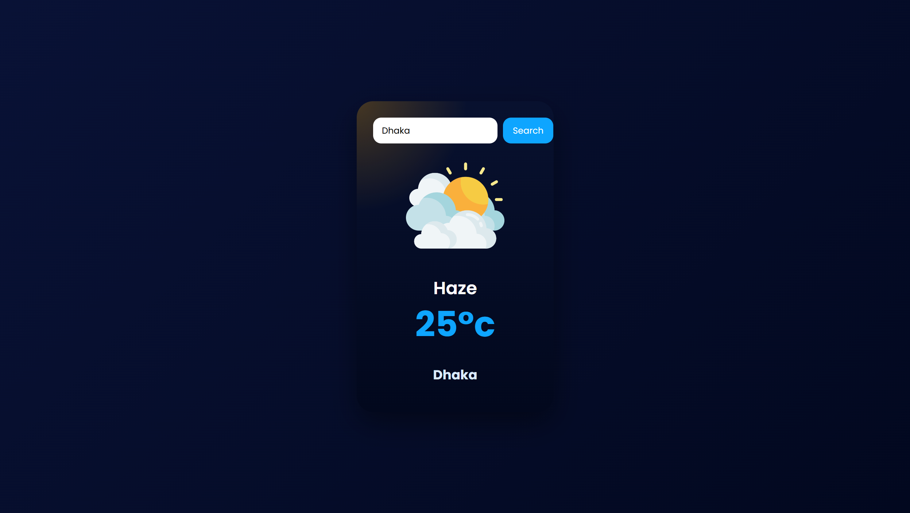

## Date: 27 April, 2026 - Monday

# 🌤️ Weather Application

Make this project with HTML, CSS and JavaScript.

## 🛠️ Tech Stack

- **HTML:** Semantic structure.
- **CSS:** Colorful and style.
- **JavaScript:** DOM manipulation and intervals.

## 📂 Project Structure

```text
weather-application/
├── README.md           # Project documentation
└── index.html          # HTML code
└── script.js           # JavaScript program
└── style.css           # CSS code
```

## 🖼️ Preview

