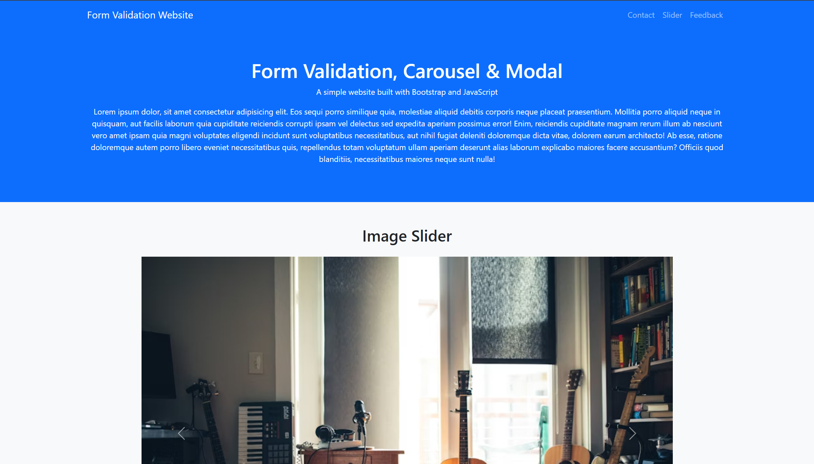

## Date: 30 April, 2026 - Thursday

# 🌐 Professional Modern Website

Make this project with HTML, CSS, Bootstrap and JavaScript. This project focus on **Date and Time show**, **Form Validation** & **Scroll to Top Button**.

## 🛠️ Tech Stack

- **HTML:** Semantic structure.
- **CSS:** Colorful and style.
- **Bootstrap:** Responsive layout & prebuilt UI components.
- **JavaScript:** DOM manipulation and intervals.

## 📂 Project Structure

```text
professional-modern-website/
├── README.md           # Project documentation
└── index.html          # HTML code + Bootstrap
└── script.js           # JavaScript program
└── style.css           # CSS code
```

## 🖼️ Preview



