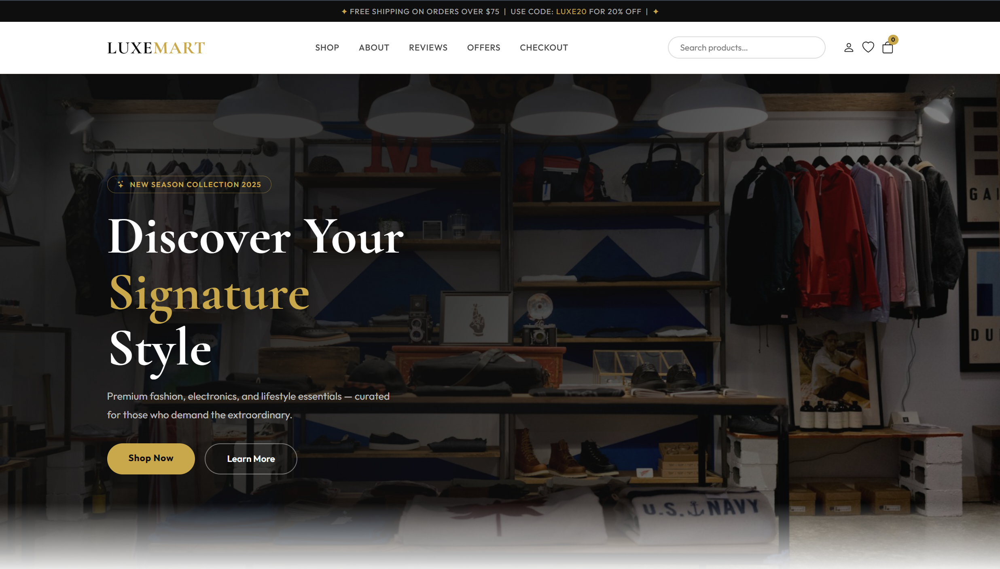
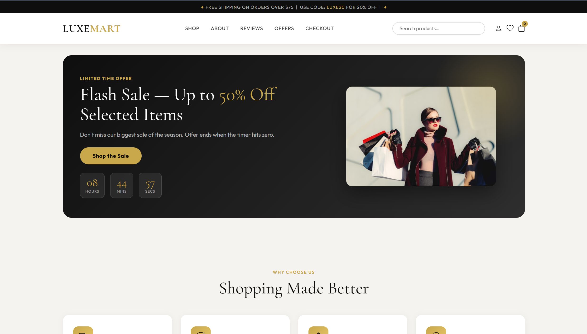
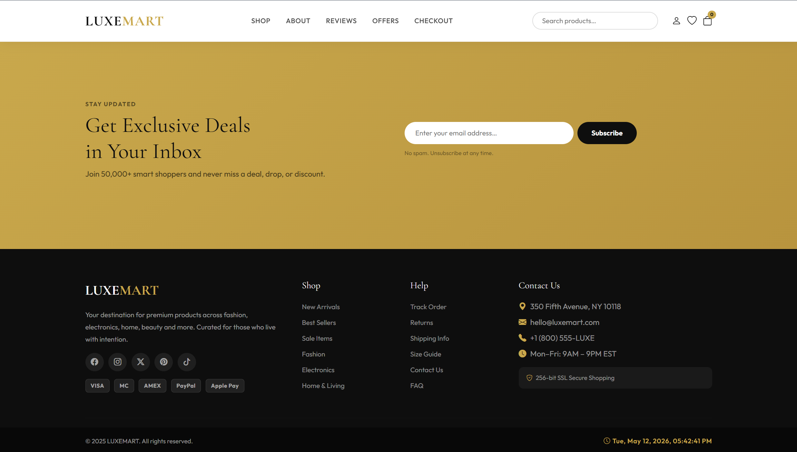

# 📅 Date: 04 May, 2026 - Monday

# Topics

- [Build E-Commerce Websites](#e-commerce-websites)
- [Short Questions](#short-questions)

---

# E-Commerce Websites

- [Back to Top ⬆️](#topics)

This **E-Commerce Websites** have shop section, about section, reviews section, offers section and checkout section and JavaScript using for **Date and Time show**, **Form Validation** & **Scroll to Top Button**.

## 🛠️ Tech Stack

- **HTML:** Semantic structure.
- **CSS:** Colorful and style.
- **Bootstrap:** Responsive layout & prebuilt UI components.
- **JavaScript:** DOM manipulation and intervals.

## 📂 Project Structure

```text
e-commerce-websites/
├── README.md           # Project documentation
└── index.html          # HTML code + Bootstrap
└── script.js           # JavaScript program
└── style.css           # CSS code
```

## 🖼️ Preview

<p align="center">
    
</p>

<p align="center">

</p>

<p align="center">

</p>

---

# Short Questions:

- [Back to Top ⬆️](#topics)

<br>

- [HTML (25 Questions)](#html-25-questions)
- [CSS (25 Questions)](#css-25-questions)
- [Bootstrap (20 Questions)](#bootstrap-20-questions)
- [JavaScript (20 Questions)](#javascript-20-questions)
- [jQuery (10 Questions)](#jquery-10-questions)
- [Advanced Questions and Answers](#advanced-questions-and-answers)

# HTML (25 Questions)

- [Back to Top ⬆️](#topics)
- [Back to - Short Questions](#short-questions)

## 1. What is HTML?

**Answer:** HTML is the standard markup language used to create web pages.

## 2. What is semantic HTML?

**Answer:** Uses meaningful tags like `<header>`, `<section>`.

## 3. Examples of semantic tags

**Answer:** `<article>`, `<nav>`, `<footer>`, `<aside>`.

## 4. What is form tag?

**Answer:** Used to collect user input.

## 5. What is input?

**Answer:** Used to take user data.

## 6. Input types

**Answer:** text, email, password, number, file.

## 7. What is form validation?

**Answer:** Checking user input.

## 8. Required attribute

**Answer:** Field must be filled.

## 9. What is table?

**Answer:** Displays data in rows and columns.

## 10. Table tags

**Answer:** `<table>`, `<tr>`, `<td>`, `<th>`.

## 11. What is ul?

**Answer:** Unordered list.

## 12. What is ol?

**Answer:** Ordered list.

## 13. What is li?

**Answer:** List item.

## 14. What is img?

**Answer:** Displays image.

## 15. What is src?

**Answer:** File source.

## 16. What is alt?

**Answer:** Alternative text.

## 17. What is video?

**Answer:** Embeds video.

## 18. What is audio?

**Answer:** Embeds audio.

## 19. What is a tag?

**Answer:** Hyperlink.

## 20. What is href?

**Answer:** Link destination.

## 21. What is div?

**Answer:** Block container.

## 22. What is span?

**Answer:** Inline container.

## 23. Block vs inline

**Answer:** Block starts new line, inline stays same line.

## 24. What is attribute?

**Answer:** Extra information about an element.

## 25. What is doctype?

**Answer:** Defines HTML version.

---

# CSS (25 Questions)

- [Back to Top ⬆️](#topics)
- [Back to - Short Questions](#short-questions)

## 26. What is CSS?

**Answer:** CSS styles HTML elements.

## 27. What is box model?

**Answer:** Content, padding, border, margin.

## 28. What is margin?

**Answer:** Outer space.

## 29. What is padding?

**Answer:** Inner space.

## 30. What is border?

**Answer:** Element outline.

## 31. What is Flexbox?

**Answer:** One-dimensional layout system.

## 32. Flex direction

**Answer:** row, column.

## 33. justify-content

**Answer:** Horizontal alignment.

## 34. align-items

**Answer:** Vertical alignment.

## 35. What is CSS Grid?

**Answer:** Two-dimensional layout system.

## 36. Grid columns

**Answer:** `grid-template-columns`.

## 37. What is media query?

**Answer:** Responsive styling rule.

## 38. Media query example

```css
@media (max-width: 768px) {
}
```

## 39. What is responsive design?

**Answer:** Design that adapts to screen size.

## 40. Class selector

**Answer:** `.class`

## 41. ID selector

**Answer:** `#id`

## 42. Class vs ID

**Answer:** Class reusable, ID unique.

## 43. Display property

**Answer:** Controls layout behavior.

## 44. display:flex

**Answer:** Activates flexbox.

## 45. Position property

**Answer:** Controls element placement.

## 46. Position types

**Answer:** static, relative, absolute, fixed.

## 47. What is z-index?

**Answer:** Stack order of elements.

## 48. What is overflow?

**Answer:** Handles extra content.

## 49. What is opacity?

**Answer:** Transparency level.

## 50. What is hover?

**Answer:** Mouse-over state.

---

# Bootstrap (20 Questions)

- [Back to Top ⬆️](#topics)
- [Back to - Short Questions](#short-questions)

## 51. What is Bootstrap?

**Answer:** CSS framework.

## 52. What is container?

**Answer:** Layout wrapper.

## 53. Types of container

**Answer:** `.container`, `.container-fluid`.

## 54. What is row?

**Answer:** Horizontal group of columns.

## 55. What is col?

**Answer:** Bootstrap column.

## 56. Grid columns

**Answer:** 12 columns.

## 57. What is navbar?

**Answer:** Navigation bar.

## 58. Navbar class

**Answer:** `.navbar`

## 59. What is card?

**Answer:** Content box.

## 60. Card classes

**Answer:** `.card`, `.card-body`.

## 61. Button class

**Answer:** `.btn`

## 62. Button color class

**Answer:** `.btn-primary`

## 63. Responsive class

**Answer:** `col-md-6`

## 64. What is breakpoint?

**Answer:** Screen size range.

## 65. Utility class

**Answer:** Helper classes.

## 66. Utility class examples

**Answer:** `mt-3`, `text-center`.

## 67. What is gutter?

**Answer:** Space between columns.

## 68. What is collapse?

**Answer:** Hide/show content.

## 69. What is modal?

**Answer:** Popup window.

## 70. Bootstrap JS

**Answer:** Adds interaction features.

---

# JavaScript (20 Questions)

- [Back to Top ⬆️](#topics)
- [Back to - Short Questions](#short-questions)

## 71. What is JavaScript?

**Answer:** Web programming language.

## 72. What is variable?

**Answer:** Stores data.

## 73. JavaScript keywords

**Answer:** `var`, `let`, `const`.

## 74. What is function?

**Answer:** Reusable block of code.

## 75. Function syntax

```javascript
function name() {}
```

## 76. What is DOM?

**Answer:** HTML represented as objects.

## 77. getElementById

**Answer:** Selects element by ID.

## 78. querySelector

**Answer:** Selects element using CSS selector.

## 79. innerHTML

**Answer:** Changes HTML content.

## 80. What is event?

**Answer:** User action.

## 81. Click event

**Answer:** Executes on click.

## 82. Submit event

**Answer:** Executes on form submission.

## 83. addEventListener

**Answer:** Attaches event listener.

## 84. alert()

**Answer:** Popup message.

## 85. console.log()

**Answer:** Displays output in console.

## 86. if statement

**Answer:** Decision-making statement.

## 87. What is loop?

**Answer:** Repeats code.

## 88. What is array?

**Answer:** List of values.

## 89. What is object?

**Answer:** Key-value data structure.

## 90. What is validation?

**Answer:** Input checking.

---

# jQuery (10 Questions)

- [Back to Top ⬆️](#topics)
- [Back to - Short Questions](#short-questions)

## 91. What is jQuery?

**Answer:** JavaScript library.

## 92. jQuery syntax

```javascript
$(selector).action();
```

## 93. Purpose of `$` sign

**Answer:** Selector shortcut.

## 94. What is document ready?

**Answer:** Runs code after page loads.

## 95. Document ready syntax

```javascript
$(document).ready(function () {});
```

## 96. click()

**Answer:** Click event method.

## 97. hide()

**Answer:** Hides element.

## 98. show()

**Answer:** Shows element.

## 99. toggle()

**Answer:** Toggles display.

## 100. css()

**Answer:** Changes CSS style.

# Advanced Questions and Answers

- [Back to Top ⬆️](#topics)
- [Back to - Short Questions](#short-questions)

# Web Protocols & HTML

## 1. Which protocol is used by the browser to request a web page?

**Answer:** HTTP or HTTPS protocol.

---

## 2. Which HTML element provides a container for navigation links?

**Answer:** The `<nav>` element.

---

## 3. What is the semantic difference between `<strong>` and `<b>` tags?

**Answer:**  
`<strong>` indicates importance, while `<b>` only makes text bold.

---

## 4. What is the difference between `<section>`, `<div>`, and `<article>`?

**Answer:**

- `<section>` = thematic group of content
- `<article>` = self-contained content
- `<div>` = general container

---

## 5. What is the basic folder structure for a web design project?

```plaintext
project/
├── index.html
├── css/
├── js/
└── images/
```

---

# CSS & Responsive Design

## 6. Which CSS property allows a flex item to shrink?

**Answer:** `flex-shrink`

---

## 7. What is the purpose of the `repeat()` function in CSS Grid?

**Answer:**  
It defines repeating rows or columns.

---

## 8. What is the purpose of the `z-index` property?

**Answer:**  
It controls the stacking order of elements.

---

## 9. How does Flexbox help in responsive design?

**Answer:**  
It automatically adjusts item size and position based on screen width.

---

## 10. What are media queries?

**Answer:**  
Media queries apply different CSS styles depending on device size.

---

## 11. Example of media query

```css
@media (max-width: 768px) {
  body {
    background: lightgray;
  }
}
```

---

## 12. What are the advantages of CSS frameworks over custom CSS?

**Answer:**

- Faster development
- Built-in responsiveness
- Cross-browser compatibility

---

## 13. What are the different CSS position values?

**Answer:**

- static
- relative
- absolute
- fixed
- sticky

---

## 14. What is the difference between relative and absolute units in CSS?

**Answer:**  
Relative units depend on parent size (`em`, `%`), while absolute units (`px`, `cm`) are fixed.

---

## 15. Which selector is most expensive for browsers to render?

**Answer:** Universal selector `*`

---

# Images & Graphics

## 16. What is the difference between raster and vector images?

**Answer:**  
Raster images are pixel-based, while vector images are shape-based and scalable.

---

## 17. Which factor affects both image quality and loading speed?

**Answer:**  
Image size and file format.

---

## 18. What are the advantages of frameworks in web development?

**Answer:**

- Faster development
- Consistent design
- Responsive layouts

---

# JavaScript Concepts

## 19. What is an array in JavaScript?

**Answer:**  
An array stores multiple values in a single variable.

---

## 20. How is `forEach()` used?

**Answer:**  
`forEach()` loops through each array element.

### Example

```javascript
let numbers = [1, 2, 3];

numbers.forEach(function (num) {
  console.log(num);
});
```

---

## 21. What is the difference between `forEach()` and `map()`?

**Answer:**  
`forEach()` executes code only, while `map()` returns a new array.

---

## 22. What is the difference between `addEventListener()` and `onclick`?

**Answer:**  
`addEventListener()` supports multiple event handlers, while `onclick` supports only one.

---

## 23. What is the difference between `==` and `===` in JavaScript?

**Answer:**  
`==` compares values only, while `===` compares both value and data type.

---

## 24. What is the purpose of the DOM?

**Answer:**  
The DOM allows JavaScript to access and manipulate HTML elements.

---

## 25. Example of `for...of` loop with an array

```javascript
let fruits = ["apple", "banana", "mango"];

for (let fruit of fruits) {
  console.log(fruit);
}
```

---

## 26. What is the use of `try...catch` in JavaScript?

**Answer:**  
It handles errors without stopping the program.

### Example

```javascript
try {
  console.log(x);
} catch (error) {
  console.log("Error handled");
}
```

---

## 27. What is the `bind()` method used for?

**Answer:**  
It binds a function to a specific object's `this` value.

---

## 28. What is the difference between synchronous and asynchronous operations?

**Answer:**

- Synchronous = one task at a time
- Asynchronous = multiple tasks run without waiting

---

# Coding Questions

## 29. Write a program to find the largest number in an array.

### Example

```javascript
let numbers = [10, 45, 78, 22];
let largest = numbers[0];

for (let num of numbers) {
  if (num > largest) {
    largest = num;
  }
}

console.log(largest);
```

---

## 30. Create an async function named `fetchData()` that fetches data from an API.

### Example

```javascript
async function fetchData() {
  try {
    const response = await fetch("https://jsonplaceholder.typicode.com/posts");
    const data = await response.json();

    console.log(data);
  } catch (error) {
    console.log(error);
  }
}

fetchData();
```

---

# ICT & Office Applications

## 31. What is the ICT Code of Conduct in the workplace?

**Answer:**  
A set of rules for responsible, ethical, and professional ICT use at work.

---

## 32. What is Mail Merge in a word processor?

**Answer:**  
Mail Merge is used to send personalized letters or emails to multiple people.

- [Back to Top ⬆️](#topics)
- [Back to - Short Questions](#short-questions)
