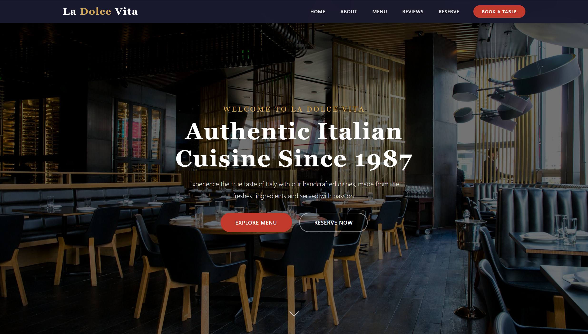
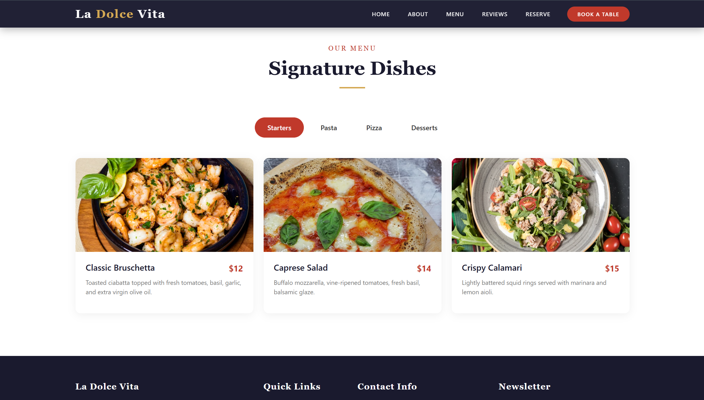
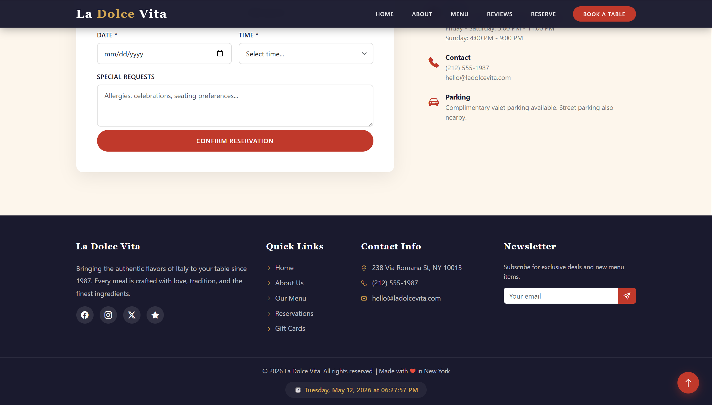

# 📅 Date: 05 May, 2026 - Tuesday

# Topics

- [Build Restaurant Websites](#restaurant-websites)
- [Short Questions](#short-questions)
- [MCQs](#mcqs)

---

# Restaurant Websites

This **Restaurant Website** have home section, about section, menu section, reviews section and reserve section and JavaScript using for **Date and Time show**, **Form Validation** & **Scroll to Top Button**.

## 🛠️ Tech Stack

- **HTML:** Semantic structure.
- **CSS:** Colorful and style.
- **Bootstrap:** Responsive layout & prebuilt UI components.
- **JavaScript:** DOM manipulation and intervals.

## 📂 Project Structure

```text
restaurant-websites/
├── README.md           # Project documentation
└── index.html          # HTML code + Bootstrap
└── script.js           # JavaScript program
└── style.css           # CSS code
```

## 🖼️ Preview

<p align="center">
    
</p>

<p align="center">

</p>

<p align="center">

</p>

---

# Short Questions:

- [Back to Top ⬆️](#topics)

## 1. What is Semantic HTML?

Semantic HTML uses meaningful tags such as `<header>`, `<section>`, and `<article>` that clearly describe the purpose of content.

---

## 2. Explain CSS Box Model

The CSS Box Model consists of:

- **Content** → Actual text/image
- **Padding** → Space inside border
- **Border** → Surrounding line
- **Margin** → Outer space

---

## 3. What is Bootstrap Grid System?

Bootstrap Grid System is a **12-column responsive layout system** using:

- `.container`
- `.row`
- `.col-*`

---

## 4. Define Flexbox

Flexbox is a **one-dimensional layout system** used to align and distribute items in rows or columns with flexible spacing.

---

## 5. What is Responsive Web Design?

Responsive Web Design ensures websites adapt to different screen sizes such as:

- Mobile
- Tablet
- Desktop

---

## 6. What is DOM in JavaScript?

DOM (Document Object Model) is a structured representation of HTML elements that allows JavaScript to access and modify content dynamically.

---

## 7. What is Form Validation?

Form validation checks user input before submission.

---

## 8. Difference between Class and ID

Class are reusable, can be used multiple times. ID is a unique and used once per page

---

## 9. What is Media Query?

A media query is a CSS feature that applies styles based on:

- Screen size
- Resolution
- Device type

---

## 10. What is Navbar in Bootstrap?

Navbar is a responsive navigation bar created using Bootstrap classes such as:

- `.navbar`
- `.navbar-brand`
- `.navbar-nav`

---

## 11. Explain HTML Form Elements

- `<input>` → User input
- `<textarea>` → Multi-line text
- `<select>` → Dropdown menu
- `<button>` → Submit or action button

---

## 12. What is JavaScript Event?

An event is an action that triggers JavaScript code execution.

### Examples:

- click
- submit
- hover
- keypress

---

# 13. Flexbox vs Grid

| Feature  | Flexbox         | Grid              |
| -------- | --------------- | ----------------- |
| Layout   | 1D (row/column) | 2D (row + column) |
| Use Case | Align items     | Full page layout  |
| Control  | Content-based   | Layout-based      |

---

# 14. DOM Manipulation

JavaScript can dynamically change HTML content using the DOM.

### Example:

```javascript
document.getElementById("title").innerHTML = "Hello World";
```
---

## 15. What are RESTful APIs?

### Answer:
RESTful APIs are web services that follow REST architecture principles.

---

## 16. What are arrays and objects in JavaScript?

### Answer:

### Arrays
Ordered collections of values.

```javascript
let numbers = [1, 2, 3];
```

### Objects
Collections of key-value pairs.

```javascript
let person = {
  name: "John",
  age: 30
};
```

---

## 17. What is the purpose of loops in JavaScript?

### Answer:
Loops are used to repeatedly execute a block of code while a condition is true.

---

## 18. Create functions in JavaScript with example.

### Answer:

```javascript
function greet() {
  console.log("Hello");
}
```

---

## 19. How do you handle conditional statements in JavaScript?

### Answer:
Using:

- `if`
- `else`
- `else if`
- `switch`

---

## 20. Explain the concept of strict mode in JavaScript.

### Answer:
Strict mode helps write secure and cleaner JavaScript code.

### Example

```javascript
"use strict";
```

---

## 21. What is event bubbling and event capturing in JavaScript?

### Answer:

### Event Bubbling
The event starts from the target element and moves upward.

### Event Capturing
The event starts from the top parent and moves downward.

---

## 22. What is the Document Object Model (DOM) in JavaScript?

### Answer:
The DOM is a programming interface for HTML and XML documents.

---

## 23. How does a static website differ from a dynamic website?

### Answer:

| Static Website | Dynamic Website |
|---|---|
| Fixed content | Interactive content |
| No database | Database-driven |
| Faster | More flexible |

---

## 24. What are some popular frameworks and platforms for dynamic websites?

### Answer:

| Language | Framework |
|---|---|
| PHP | Laravel |
| Python | Django |
| JavaScript | Node.js |
| Java | Spring |
| .NET | ASP.NET |

---

## 25. What role do search engines play on the Internet?

### Answer:
Search engines:

- Crawl websites
- Index website content
- Retrieve relevant information based on user searches

---

## 26. What are the main features of an interactive website?

### Answer:

- User input forms
- Real-time updates
- Interactive maps
- Animations and transitions
- Social media integration

---

## 27. What key features are important in a code editor?

### Answer:

- Integrated Git support
- Debugging tools
- Plugin/extensions support
- Multi-language support
- Customizable interface

---

## 28. How do you ensure designs work on desktop and mobile browsers?

### Answer:

- Use responsive design
- Apply CSS media queries
- Test on real devices
- Optimize performance for mobile users

---

## 29. What is PHPMyAdmin?

### Answer:
PHPMyAdmin is a web-based tool used to manage MySQL databases.

---

# MCQs

- [Back to Top ⬆️](#topics)
- [Back to - Short Questions](#short-questions)

## 1. Which of these is NOT a primary color in RGB?

a) Red  
b) Blue  
c) Yellow  
d) Green  

### Answer:
**c) Yellow**

---

## 2. Which tool is used to remove a background in Photoshop?

a) Clone Stamp  
b) Magic Wand  
c) Dodge Tool  
d) Healing Brush  

### Answer:
**b) Magic Wand**

---

## 3. What is the function of the Pen Tool in Adobe Illustrator?

a) To paint freehand  
b) To create precise vector paths and shapes  
c) To erase elements  
d) To adjust brightness  

### Answer:
**b) To create precise vector paths and shapes**

---

## 4. What is Axios and what is its main purpose?

A) A CSS framework  
B) A promise-based HTTP client for making HTTP requests  
C) A JavaScript library for DOM manipulation  
D) A database management tool  

### Answer:
**B) A promise-based HTTP client for making HTTP requests**

---

## 5. How can you troubleshoot and debug issues related to JavaScript libraries in a web application?

A) By using print statements  
B) By using developer tools, console logs, and debugging tools like breakpoints and stack traces  
C) By restarting the browser  
D) By reinstalling the libraries  

### Answer:
**B) By using developer tools, console logs, and debugging tools like breakpoints and stack traces**

---

## 6. Which software is best for creating documents?

a) Microsoft Word  
b) Adobe Photoshop  
c) VLC Media Player  
d) Google Chrome  

### Answer:
**a) Microsoft Word**

---

## 7. What is the primary use of Microsoft Excel?

a) Editing videos  
b) Creating spreadsheets  
c) Browsing the internet  
d) Playing games  

### Answer:
**b) Creating spreadsheets**

---

## 8. What is the purpose of the 'Track Changes' feature in Microsoft Word?

a) To count words  
b) To edit images  
c) To review and manage document edits  
d) To change font size  

### Answer:
**c) To review and manage document edits**

---

## 9. Why is active listening important in workplace interaction?

a) It helps in avoiding work  
b) It ensures clear understanding and better collaboration  
c) It makes communication difficult  
d) It reduces teamwork  

### Answer:
**b) It ensures clear understanding and better collaboration**

---

## 10. How do you perform basic input validation in JavaScript?

A) Using if-else statements  
B) Using switch statements  
C) Using try-catch blocks  
D) Using alert() and prompt()  

### Answer:
**A) Using if-else statements**

---

## 11. How do you concatenate strings in JavaScript?

A) Using + operator  
B) Using * operator  
C) Using & operator  
D) Using - operator  

### Answer:
**A) Using + operator**

---

## 12. Which tool in MS Word is used to create a list?

a) Bold  
b) Bullet points  
c) Text Alignment  
d) Font Size  

### Answer:
**b) Bullet points**

---

## 13. Which of these is NOT part of workplace safety?

a) Following safety protocols  
b) Using PPE  
c) Ignoring minor hazards  
d) Reporting unsafe conditions  

### Answer:
**c) Ignoring minor hazards**

---

## 14. What is the most effective way to communicate in a professional setting?

a) Using informal language  
b) Being clear and concise  
c) Using slang and abbreviations  
d) Avoiding eye contact  

### Answer:
**b) Being clear and concise**

---

## 15. What is Bootstrap and what role does it play in web design?

A) A JavaScript framework  
B) A CSS framework for building responsive and mobile-first websites  
C) A database management system  
D) A server-side scripting language  

### Answer:
**B) A CSS framework for building responsive and mobile-first websites**

- [Back to Top ⬆️](#topics)
- [Back to - Short Questions](#short-questions)
- [Back to - MCQs](#mcqs)