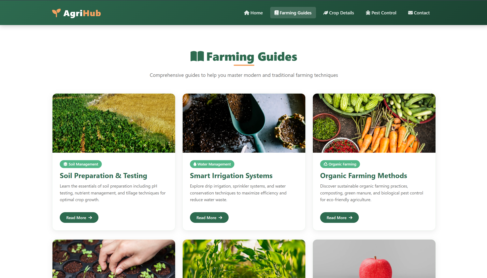
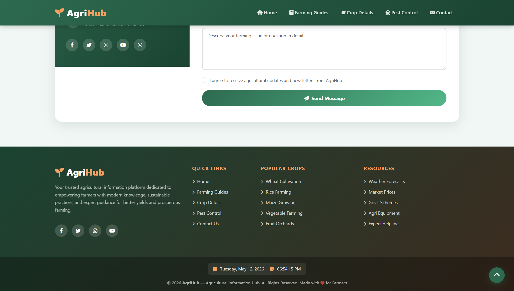

# 📅 Date: 06 May, 2026 - Wednesday

# Topics

- [Build Agricultural Information Hub](#agricultural-information-hub)
- [Short Questions](#short-questions)

---

# Agricultural Information Hub

This **Agricultural Information Hub** have home section, farming guides, crop details, pest control and contact section and JavaScript using for **Date and Time show**, **Form Validation** & **Scroll to Top Button**.

## 🛠️ Tech Stack

- **HTML:** Semantic structure.
- **CSS:** Colorful and style.
- **Bootstrap:** Responsive layout & prebuilt UI components.
- **JavaScript:** DOM manipulation and intervals.

## 📂 Project Structure

```text
agricultural-information-hub/
├── README.md           # Project documentation
└── index.html          # HTML code + Bootstrap
└── script.js           # JavaScript program
└── style.css           # CSS code
```

## 🖼️ Preview

<p align="center">
    
</p>

<p align="center">

</p>

<p align="center">

</p>

---

# Short Questions:

- [Back to Top ⬆️](#topics)

### Q1. How do you ensure accessibility compliance when integrating JavaScript libraries into web applications?

**Answer:**

- Use ARIA attributes (such as `aria-label`, `aria-hidden`).
- Test with screen readers and keyboard navigation.
- Apply ARIA live regions or `role="alert"` when dynamic content is updated via JavaScript.

### Q2. Which image format supports transparency and is commonly used for web graphics and images with transparent backgrounds?

**Answer:** PNG (Portable Network Graphics) is a lossless format and supports transparent backgrounds. [web:1][web:10]

### Q3. What is the function of the HTML style attribute?

**Answer:** The `style` attribute is used to add inline CSS styles directly to an HTML element.

### Q4. What tag is used to render an image on a webpage?

**Answer:** ``

### Q5. What is the most basic part of any HTML page?

**Answer:** Plain text (such as UTF‑8 or ASCII text content).

### Q6. How many characters can be written in 1KB?

**Answer:** Approximately 1024 characters (assuming ASCII text, 1 byte per character).

### Q7. Explain the difference between the `==` and `===` operators in JavaScript.

**Answer:**

- `==` performs loose equality comparison (with type coercion).
- `===` performs strict equality comparison (checks both value and type).

### Q8. What are logical operators?

**Answer:** Logical operators work with boolean values:

- `&&` (AND)
- `||` (OR)
- `!` (NOT) [web:10]

### Q9. How do you use the `break` statement in loops and switches in JavaScript?

**Answer:** The `break` statement terminates the execution of a loop or `switch` immediately.

### Q10. How do you display output in JavaScript?

**Answer:**

- `console.log()`
- `alert()`
- `document.write()` [web:1][web:10]

### Q11. What are single‑line and multi‑line comments in JavaScript? How do you comment out code?

**Answer:**

- Single‑line comment: `//`
- Multi‑line comment: `/* ... */`

### Q12. Select the basic data types in JavaScript.

**Answer:**

- `Number`
- `String`
- `Boolean`
- `Null`
- `Undefined`
- `Symbol` (ES6+)
- `BigInt` (ES2020+)

### Q13. How do you check the data type of a variable in JavaScript?

**Answer:** Use the `typeof` operator.

### Q14. What are arithmetic operators in JavaScript? Provide examples.

**Answer:** Arithmetic operators perform mathematical operations:

- `+` (addition)
- `-` (subtraction)
- `*` (multiplication)
- `/` (division)
- `%` (modulus)
- `**` (exponentiation)

### Q15. Which keyword is used to declare a variable in JavaScript?

**Answer:** `var`, `let`, `const` (ES6+).

### Q16. Which operator is used for strict equality comparison in JavaScript?

**Answer:** `===`

### Q17. Which function is used to output data to the console in JavaScript?

**Answer:** `console.log()`

### Q18. Which built‑in method is used to convert a string to an integer in JavaScript?

**Answer:** `parseInt()`

### Q19. What is the purpose of Tailwind CSS and how does it differ from other frameworks like Bootstrap?

**Answer:**

- Tailwind CSS is a utility‑first CSS framework (e.g., `text-center`, `bg-blue-500`).
- Bootstrap is a component‑based framework (with prebuilt components such as buttons and navbars). [web:5][web:8]

### Q20. What is an ID selector in CSS?

**Answer:** An ID selector targets a single unique element using a `#`.

### Q21. How do you apply multiple CSS classes to a single HTML element?

**Answer:** Add multiple class names separated by spaces.

### Q22. How do we write comments in CSS?

**Answer:** `/* ... */`

### Q23. Which CSS property is used to control the transparency of an element?

**Answer:** `opacity`

### Q24. Which CSS property is used for controlling layout?

**Answer:** `display` (e.g., `block`, `inline`, `flex`, `grid`).

### Q25. Which CSS box model components are transparent?

**Answer:** Both `margin` and `padding` are transparent; only the `border` and `content` are visually filled.

<br>

- [Back to Top ⬆️](#topics)
- [Back To - Short Questions](#short-questions)

<br>

### Q26. Which Bootstrap class is used to create a responsive navigation bar?

**Answer:** `.navbar-expand` (often combined with `.navbar-light`, `.navbar-collapse`, etc.).

### Q27. What is the purpose of the card class in Bootstrap?

**Answer:** The `.card` class creates a flexible content container with optional `.card-header`, `.card-body`, and `.card-footer`.

### Q28. What is a function in JavaScript? Give an example.

**Answer:** A function is a reusable block of code that performs a specific task.

```js
function hello() {
  console.log("Hello World");
}
hello();
```

### Q29. What are arrays in JavaScript? Give an example.

**Answer:** An array is a special variable that stores multiple values.

```js
let data = [10, 20, "Hello", 20.34, true, false];
```

### Q30. What is JSON? Give an example JSON.

**Answer:** JSON is a lightweight data‑interchange format.

```js
let student = { name: "Rubel", city: "Dhaka" };
```

### Q31. Create a JSON array that contains four students with name, email, mobile, and address.

```js
let students = [
  {
    name: "Arif",
    email: "arif@gmail.com",
    mobile: "01313363836",
    address: "Dhaka",
  },
];
```

### Q32. How do you create functions in JavaScript?

```js
// Function declaration
function greet(name) {
  return "Hello " + name;
}
```

### Q33. Describe different types of repetition statements in JavaScript.

**Answer:**

- `for` → when the number of iterations is known.
- `while` → runs while the condition is true.
- `do...while` → runs at least once, then checks the condition.
- `forEach`, `for...in` → used to iterate over arrays or objects.

### Q34. Describe different types of conditional statements in JavaScript.

**Answer:**

- `if` → runs code if the condition is true.
- `if...else` → runs one block if true, another if false.
- `if...else if...else` → multiple conditions.
- `switch` → tests a value against multiple cases.

### Q35. What is the Document Object Model (DOM)?

**Answer:** The DOM is a programming interface that represents HTML/XML documents as a tree of nodes. JavaScript can modify the DOM to change content, structure, and styles dynamically.

### Q36. Create an HTML registration form with username, email, mobile, and address.

```html
<form>
  <div>
    <label for="name">User Name</label>
    <input type="text" id="name" name="name" />
  </div>
  <div>
    <label for="email">Email</label>
    <input type="email" id="email" name="email" />
  </div>
  <div>
    <label for="mobile">Mobile</label>
    <input type="number" id="mobile" name="mobile" />
  </div>
  <div>
    <label for="address">Address</label>
    <textarea name="address"></textarea>
  </div>
</form>
```

### Q37. How do you create an HTML login form with a submit button?

```html
<!DOCTYPE html>
<html>
  <head>
    <title>Login Form</title>
  </head>
  <body>
    <h2>Login Form</h2>
    <form action="/login" method="post">
      <label for="username">Username:</label>
      <input type="text" id="username" name="username" required /><br /><br />
      <label for="password">Password:</label>
      <input
        type="password"
        id="password"
        name="password"
        required
      /><br /><br />
      <input type="submit" value="Login" />
    </form>
  </body>
</html>
```

### Q38. When should you use SVG images?

**Answer:** Use SVG for:

- Logos, icons, and simple illustrations.
- Scalable vector graphics that stay sharp at any size.
- Lightweight, editable, and SEO‑friendly graphics.

### Q39. What are arrays and objects in JavaScript?

**Answer:**

- Arrays are ordered collections that can hold multiple values of any type.
- Objects are collections of key‑value pairs where each key is a string or symbol.

### Q40. How do you access arrays and their elements, and objects and their properties?

**Answer:**

- Arrays: Use an index, e.g., `fruits[0]`.
- Objects: Use dot or bracket notation, e.g., `person.name` or `person["age"]`.

### Q41. How does an interactive website differ from static and dynamic websites?

**Answer:**

- **Static website:** Contains fixed content; no server‑side processing.
- **Dynamic website:** Server‑side scripting (e.g., PHP, Node.js) loads data from a database.

### Q42. Which code editor do you prefer for web design and development projects, and why?

**Answer:**

- **Visual Studio Code (VS Code)**
  - Fast, lightweight, and highly customizable.
  - Rich extension ecosystem for HTML, CSS, and JavaScript.
  - Built‑in terminal and Git integration.
  - Strong debugging support.

### Q43. What is the basic purpose of FTP (File Transfer Protocol) software in web development?

**Answer:** FTP software is used to upload, download, and manage files between a local computer and a web server, making the website accessible online. [web:10]

### Q44. How do you generate random numbers in JavaScript?

**Answer:**  
Use `Math.random()`.

### Q45. How do you create a multiline string in JavaScript?

**Answer:** Use template literals with backticks (\` \` ).

### Q46. What are `let`, `const`, and `class` keywords introduced in ES6? How do they differ from ES5?

**Answer:**

- `let` → block‑scoped variable declaration.
- `const` → block‑scoped constant (cannot be re‑assigned).
- `class` → syntactic sugar for constructor functions and prototypes.

### Q47. What is jQuery and what is its main purpose in web development?

**Answer:**  
jQuery is a popular JavaScript library that simplifies HTML DOM manipulation, event handling, animations, and AJAX calls.

### Q48. What is the purpose of the `alt` attribute in HTML image tags?

**Answer:**  
The `alt` attribute provides alternative text for accessibility and when the image cannot be loaded.

### Q49. What is Bootstrap and what role does it play in web design?

**Answer:**  
Bootstrap is a CSS framework used to build responsive, mobile‑first websites. It provides pre‑built components (buttons, navbars, cards, grids) and a responsive grid system.

---

### Q50. Which CSS property controls the spacing between lines of text?

**Answer:** `line-height`

<br>

- [Back to Top ⬆️](#topics)
- [Back To - Short Questions](#short-questions)

<br>

### Q51. What does the `float` property in CSS do?

**Answer:**  
`float` removes an element from the normal flow and shifts it left or right within its container. It is often used for basic layouts (though modern CSS prefers Flexbox/Grid).

### Q52. What does the `z-index` property in CSS control?

**Answer:**  
`z-index` controls the stacking order of positioned elements (relative, absolute, fixed). Higher `z-index` values appear “in front”.

### Q53. Which HTML tag is used to define a table row?

**Answer:** `<tr>`

### Q54. Which keyword is used to declare a variable in JavaScript?

**Answer:** `var`, `let`, or `const`.

### Q55. Which operator is used for strict equality comparison in JavaScript?

**Answer:** `===`

### Q56. Which function is used to output data to the console in JavaScript?

**Answer:** `console.log()`

### Q57. Which built‑in method is used to convert a string to an integer in JavaScript?

**Answer:** `parseInt()`

### Q58. What does the `querySelector()` method do in JavaScript?

**Answer:**  
`querySelector()` returns the first element that matches a given CSS selector.

### Q59. How do VPNs (Virtual Private Networks) enhance intranet security and connectivity?

**Answer:**  
VPNs encrypt data during transmission and create a secure, private tunnel over the internet. They allow remote users to safely access intranet resources as if they were on the same local network.

### Q60. How does an interactive website differ from static and dynamic websites?

**Answer:**

- **Static website:** Fixed content, no server‑side processing.
- **Dynamic website:** Content loaded from a database via server‑side code (e.g., PHP, Node.js).

### Q61. Which code editor do you prefer for web design and development projects, and why?

**Answer:**  
**Visual Studio Code (VS Code):**

- Fast, lightweight, and highly customizable.
- Rich extensions for HTML, CSS, and JavaScript.
- Built‑in terminal and Git integration.
- Strong debugging tools.

### Q62. Can you explain the basic purpose of FTP (File Transfer Protocol) software in web development?

**Answer:**  
FTP is used to upload, download, and manage files between a local computer and a web server. It is essential for deploying and maintaining website files (HTML, CSS, JS, images).

### Q63. How do you create an HTML login form with a submit button?

```html
<form action="/submit-login" method="POST">
  <label for="username">Username:</label>
  <input type="text" id="username" name="username" />

  <label for="password">Password:</label>
  <input type="password" id="password" name="password" />

  <button type="submit">Login</button>
</form>
```

### Q64. When should you use SVG images?

**Answer:**  
Use SVG for scalable vector graphics such as icons and logos. SVGs stay sharp at any resolution, have small file sizes, and can be styled with CSS and scripted with JavaScript.

### Q65. What is an ID selector in CSS?

**Answer:**  
An ID selector targets a single unique element using its `id` attribute.

### Q66. How do you apply multiple CSS classes to a single HTML element?

**Answer:**  
Separate class names with spaces in the `class` attribute.

### Q67. How do you create functions in JavaScript?

```js
function greet(name) {
  return `Hello, ${name}!`;
}
```

### Q68. Can you explain the difference between function declarations and function expressions?

**Answer:**

- **Function declaration:** Defined with `function` keyword and is hoisted.
  ```js
  function sum(a, b) {
    return a + b;
  }
  ```
- **Function expression:** Assigned to a variable and is not hoisted.
  ```js
  const sum = function (a, b) {
    return a + b;
  };
  ```

### Q69. What are arrays and objects in JavaScript?

**Answer:**

- **Array:** Ordered list of values.
  ```js
  let numbers =;[11][12][13]
  ```
- **Object:** Collection of key‑value pairs.
  ```js
  let person = { name: "Alice", age: 25 };
  ```


### Q70. Can you explain the difference between `for`, `while`, and `do‑while` loops?

**Answer:**

- `for` loop → runs a set number of times.
- `while` loop → runs while the condition is `true`.
- `do‑while` loop → runs at least once, then checks the condition.  

### Q71. How do you handle conditional statements in JavaScript?

**Answer:**  
Use `if`, `else`, `else if`, `switch`, or ternary operator.  

### Q72. How do you create a new Google Sheet in your Google Drive?

**Answer:**

1. Open Google Drive.
2. Click **New** → **Google Sheets**.
3. Name and customize your sheet.  
   You can then add formulas, charts, and formatting directly in the browser.

<br>

- [Back to Top ⬆️](#topics)
- [Back To - Short Questions](#short-questions)
