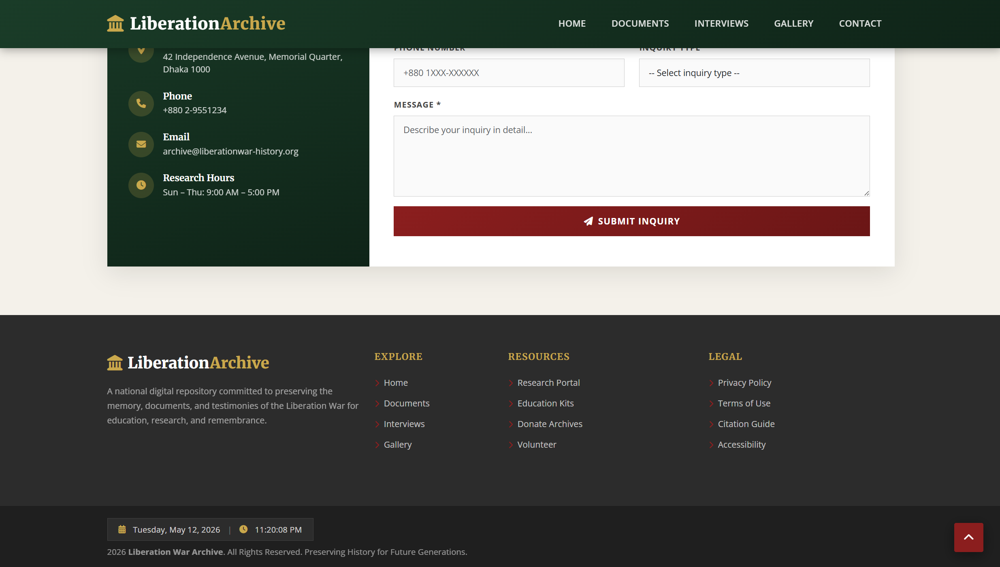

# 📅 Date: 07 May, 2026 - Thursday

# Topics

- [Build Liberation War Archive](#liberation-war-archive)
- [Short Questions](#short-questions)

---

# Liberation War Archive

This **Liberation War Archive** have home section, documents section, interviews section, gallery section and contact section and JavaScript using for **Date and Time show**, **Form Validation** & **Scroll to Top Button**.

## 🛠️ Tech Stack

- **HTML:** Semantic structure.
- **CSS:** Colorful and style.
- **Bootstrap:** Responsive layout & prebuilt UI components.
- **JavaScript:** DOM manipulation and intervals.

## 📂 Project Structure

```text
liberation-war-archive/
├── README.md           # Project documentation
└── index.html          # HTML code + Bootstrap
└── script.js           # JavaScript program
└── style.css           # CSS code
```

## 🖼️ Preview

<p align="center">
    
</p>

<p align="center">

</p>

<p align="center">

</p>

---

# Short Questions:

- [Back to Top ⬆️](#topics)

1. What behavior is a component of active listening during negotiations?  
   **Answer:** d) Maintaining eye contact

2. What is the ultimate goal of managing and reporting hazards and incidents in the workplace?  
   **Answer:** a) To create a proactive safety culture and prevent recurrence.

3. Which of the following is a popular code editor for web development?  
   **Answer:** a) Visual Studio Code

4. Consistent use of colors, fonts, and shapes across pages helps:  
   **Answer:** a) Strengthen branding and recognition

5. Why is typography important in web design?  
   **Answer:** a) It controls content readability

6. Why is device testing important in color selection?  
   **Answer:** d) To ensure colors look consistent across screens

7. What does CSS stand for in web design?  
   **Answer:** c) Cascading Style Sheets

8. Which tool is widely used to generate color palettes?  
   **Answer:** b) Adobe Color

9. What is the correct HTML5 element for embedding an external SVG image?  
   **Answer:** b) `` or d) `<object>` (common practice: ``).

10. Which of the following is the correct file extension for an HTML document?  
    **Answer:** d) Both A and B (`.html` or `.htm`)

11. Which attribute specifies the language of the HTML document?  
    **Answer:** b) lang

12. How do you change text color?  
    **Answer:** c) color

13. How do you set a background color?  
    **Answer:** b) background-color

14. How do you fix an element at bottom while scrolling?  
    **Answer:** a) `position: fixed; bottom: 0;`

15. What is the purpose of inspecting a design file before development?  
    **Answer:** d) To gather information for layout structure, typography, and color usage

16. Which file format is most commonly used for icons in web design?  
    **Answer:** c) SVG

17. Which file format is best for exporting high‑quality images with transparency for the web?  
    **Answer:** b) PNG

18. Which method is used to select an element by its ID in JavaScript?  
    **Answer:** d) getElementById

19. What does `typeof null` return in JavaScript?  
    **Answer:** b) object

20. Which keywords were introduced in ES6 for variable declaration?  
    **Answer:** b) let and const

21. How to align items horizontally in Flexbox?  
    **Answer:** `justify-content: center;`

22. Can a `const` variable be reassigned after initialization?  
    **Answer:** No.

23. Which operator represents logical OR in JavaScript?  
    **Answer:** `||`

24. Which questioning technique is most effective for gathering broad, descriptive information?  
    **Answer:** Open‑ended questions.

25. What type of hazard is a slippery floor classified as?  
    **Answer:** Physical hazard.

26. Which principle is applied when a website adapts to mobile screens?  
    **Answer:** Responsiveness.

27. How do containers help in modular design?  
    **Answer:** They group related content, making layouts easier to manage, responsive, and reusable.

28. What is the primary function of the `colspan` attribute in an HTML table?  
    **Answer:** It makes a `<td>` or `<th>` span multiple columns horizontally.

29. What is the difference between exporting an asset as PNG and JPEG for web use?  
    **Answer:** Use PNG for transparency and crisp graphics (logos, icons); use JPEG for photos without transparency.

30. If a design uses 16px on desktop and 14px on mobile, how would you implement this change in CSS without duplicating code?  
    **Answer:**  
    ```css
    body { font-size: 16px; }
    @media (max-width: 768px) {
        body {
            font-size: 14px;
        }
    }
    ```

<br>

- [Back to Top ⬆️](#topics)
- [Back To - Short Questions](#short-questions)

## 1. Communication, Safety & Tools

1. What ensures clear understanding and better collaboration?  
   **Answer:** c) It ensures clear understanding and d) It reduces confusion → main idea: **clear, concise communication**.

2. How do you perform basic input validation in JavaScript?  
   **Answer:** a) Using if‑else statements (or `switch`, `try‑catch` also possible, but `if‑else` is the most common base).

3. How do you concatenate strings in JavaScript?  
   **Answer:** a) Using `+` operator  
   Example: `"First" + " " + "Second"`

4. What is Bootstrap and what role does it play in web design?  
   **Answer:** b) A CSS framework for building responsive and mobile‑first websites.

5. What is Axios and what is its main purpose?  
   **Answer:** b) A cross‑platform HTTP client for making HTTP requests (e.g., `GET`, `POST`, `PUT`, `DELETE`).

6. How can you troubleshoot and debug issues related to JavaScript libraries?  
   **Answer:** b) Use browser developer tools, `console.log`, breakpoints, and stack traces.

7. Which software is best for creating documents?  
   **Answer:** a) Microsoft Word

8. What is the primary use of Microsoft Excel?  
   **Answer:** b) Creating spreadsheets

9. What is the purpose of the ‘Track Changes’ feature in Microsoft Word?  
   **Answer:** b) To review and manage document edits.

10. Which tool in MS Word is used to create a list?  
    **Answer:** b) Bullet points (and numbered lists).

11. Which of these is NOT a primary color in RGB?  
    **Answer:** c) Yellow

12. Which tool is used to remove a background in Photoshop?  
    **Answer:** b) Magic Wand (often with other tools like Pen Tool or Refine Edge).

13. What is the function of the Pen Tool in Adobe Illustrator?  
    **Answer:** b) To create precise vector paths and shapes.

14. Which of these is NOT part of workplace safety?  
    **Answer:** c) Ignoring minor hazards

15. What is the most effective way to communicate in a professional setting?  
    **Answer:** b) Being clear and concise

16. Why is active listening important in workplace interaction?  
    **Answer:** b) It ensures clear understanding and better collaboration.

17. What is the purpose of loops in JavaScript?  
    **Answer:** To repeat a block of code while a condition is true.

18. How do you handle conditional statements in JavaScript?  
    **Answer:** Use `if`, `else if`, `else`, `switch`, or the ternary operator (`? :`).

19. What is the Document Object Model (DOM) in JavaScript?  
    **Answer:** The DOM is a tree‑like structure representing the HTML page; JavaScript can manipulate elements, styles, and content through it.

20. What is the concept of event bubbling and event capturing in JavaScript?  
    **Answer:**  
    - **Event bubbling:** Event starts at the child element and bubbles up to the parent.  
    - **Event capturing:** Event starts at the parent and goes down to the child.

21. What role do search engines play in indexing and retrieving information from the Internet?  
    **Answer:** Search engines crawl websites, index them, and retrieve relevant results based on user queries.

22. What are RESTful APIs?  
    **Answer:** RESTful APIs use HTTP methods (`GET`, `POST`, `PUT`, `DELETE`) to let clients and servers communicate; they usually send data in JSON format.

23. What is PHPMyAdmin, and how is it used in web development?  
    **Answer:** PHPMyAdmin is a web‑based tool for managing MySQL databases (create, edit, backup, run SQL queries).

24. How does a static website differ from a dynamic website?  
    **Answer:**  
    - Static: fixed content, simple, fast, low interaction.  
    - Dynamic: content comes from a database, more complex and interactive.

25. What are some popular frameworks and platforms for dynamic websites?  
    **Answer:** Laravel, CodeIgniter, Symfony, Express.js, Next.js, Django.

26. What are the main features of an interactive website?  
    **Answer:** User interaction, dynamic content, multimedia, easy navigation, responsiveness.

27. How do you ensure designs are compatible with desktop and mobile browsers?  
    **Answer:** Use responsive design, media queries, cross‑browser testing, and grid/flex layouts.

28. What key features do you look for in a code editor?  
    **Answer:** Syntax highlighting, auto‑completion, file browser, Git integration, web preview, debugging tools.

29. Create a function in JavaScript (example)?  
    **Answer:**  
    ```js
    function sayHello() {
      console.log("Hello, World!");
    }
    sayHello();
    ```

30. What are arrays and objects in JavaScript?  
    **Answer:**  
    - **Array:** Ordered list of values, e.g., `[1, 2, 3]`.  
    - **Object:** Collection of key‑value pairs, e.g., `{ name: "Alice", age: 25 }`.

<br>

- [Back to Top ⬆️](#topics)
- [Back To - Short Questions](#short-questions)

---

## 2. General MCQs (Short Answers)

1. What is the difference between HTML tag, element, and attribute?  
   **Answer:**  
   - **Tag:** `<>` syntax, e.g., `<p>`.  
   - **Element:** tag + content + end tag, e.g., `<p>Hello</p>`.  
   - **Attribute:** Extra info inside the tag, e.g., `style="color: red"`.

2. What are the two types of HTML elements and how do they function?  
   **Answer:**  
   - **Block‑level:** Starts on a new line and takes full width, e.g., `<div>`, `<p>`.  
   - **Inline:** Stays within the same line, e.g., `<span>`, `<strong>`.

3. Which code editor do you use most and why?  
   **Answer:** VS Code (integrated terminal, Git, extensions, fast, good for HTML/CSS/JS).

4. Write the HTML boilerplate.  
   **Answer:**  
   ```html
   <!DOCTYPE html>
   <html>
   <head>
     <title>Title</title>
   </head>
   <body>
   </body>
   </html>
   ```

5. How many types of layout does Bootstrap have?  
   **Answer:** Two main types: Grid layout and Flex layout.

6. What does the Bootstrap `card` class do?  
   **Answer:** Makes a flexible, reusable container for content, images, headers, and footers.

7. What is the difference between JavaScript and Java?  
   **Answer:**  
   - Java: general‑purpose, compiled, object‑oriented.  
   - JavaScript: scripting language for web interactivity.

8. How do you declare a function in JavaScript?  
   **Answer:**  
   ```js
   function myFunction() {
     console.log('Hello World');
   }
   ```

9. What is used to write conditions in JavaScript?  
   **Answer:** `if`, `else if`, `else`, `switch`, ternary operator (`condition ? a : b`).

10. What is the difference between static, interactive, and dynamic websites?  
    **Answer:**  
    - **Static:** fixed content.  
    - **Dynamic:** content from a database.  
    - **Interactive:** responds to user input (forms, buttons, live updates).

11. What is the difference between `for`, `while`, and `do‑while` loops?  
    **Answer:**  
    - `for`: loop a fixed number of times.  
    - `while`: runs while condition is true.  
    - `do‑while`: runs at least once, then checks condition.

12. The most basic element of any HTML page is:  
    **Answer:** Plain text (ASCII/UTF‑8).

13. What is the difference between DOM and BOM?  
    **Answer:**  
    - **DOM:** tree of HTML/XML elements.  
    - **BOM:** browser objects like `window`, `navigator`, `location`.

14. Write the HTML boilerplate code.  
    **Answer:** same as Q4.

15. Create a JSON array for 4 students.  
    **Answer:**  
    ```js
    [
      {"name": "Alice", "phone": "1234567890", "email": "alice@example.com"},
      {"name": "Bob", "phone": "2345678901", "email": "bob@example.com"},
      {"name": "Charlie", "phone": "3456789012", "email": "charlie@example.com"},
      {"name": "Diana", "phone": "4567890123", "email": "diana@example.com"}
    ]
    ```

16. What is a function in JavaScript, and how does it work?  
    **Answer:** Code block that runs when called.  
    Example:  
    ```js
    function greet() { return "Hello"; }
    console.log(greet());
    ```

17. Write a CSS comment.  
    **Answer:** `/* This is a CSS comment */`

18. Write a JavaScript array.  
    **Answer:** `let fruits = ['Apple', 'Banana', 'Cherry'];`

19. What are `margin` and `padding` in CSS?  
    **Answer:**  
    - `margin`: space outside the border.  
    - `padding`: space inside the border, around the content.

20. Which protocol is used by the browser to request a web page?  
    **Answer:** HTTP or HTTPS.

21. Which HTML element provides a container for navigation links?  
    **Answer:** `<nav>`

22. What is the semantic difference between `<strong>` and `<b>`?  
    **Answer:** `<strong>` means “important”; `<b>` just makes text bold visually.

23. Which CSS property allows a flex item to shrink?  
    **Answer:** `flex-shrink`

24. What is the purpose of the `repeat()` function in CSS Grid?  
    **Answer:** To define repeating columns or rows.

25. What advantages do frameworks provide in web development?  
    **Answer:** Faster development, consistent design, responsive layout, cross‑browser support.

26. Which factor affects both image quality and loading speed?  
    **Answer:** Image size and file format.

27. Which selector is most expensive for the browser to render?  
    **Answer:** Universal selector (`*`).

28. Write a coding question (JavaScript logic).  
    **Answer:** “Write a program to find the largest number in an array.”

29. Write a coding question based on `fetchData()`.  
    **Answer:** “Create an async function `fetchData()` that fetches data from an API and logs it to the console.”

30. What is the ICT Code of Conduct in the workplace?  
    **Answer:** A set of rules for responsible, ethical, and professional use of ICT tools at work.

31. What is Mail Merge?  
    **Answer:** Tool to send personalized letters or emails to many people at once.

32. What is the basic folder structure for a web project?  
    **Answer:**  
    ```
    project/
    ├── index.html
    ├── css/
    ├── js/
    └── images/
    ```

33. What is the difference between `<section>`, `<div>`, and `<article>`?  
    **Answer:**  
    - `<section>`: thematically grouped content.  
    - `<article>`: self‑contained content.  
    - `<div>`: general container (no semantic meaning).

34. What is the difference between raster and vector images?  
    **Answer:**  
    - **Raster:** pixel‑based (e.g., JPG, PNG).  
    - **Vector:** shape‑based, scalable (e.g., SVG).

35. What is the difference between relative and absolute units in CSS?  
    **Answer:**  
    - **Relative:** `em`, `%`, `rem` depend on context.  
    - **Absolute:** `px`, `cm`, `in` are fixed.

36. What is an array, and how is `forEach()` used?  
    **Answer:** Array stores multiple values; `forEach()` runs a function for each element.

37. What is the difference between `addEventListener()` and `onclick`?  
    **Answer:**  
    - `addEventListener()`: attach multiple events to the same element.  
    - `onclick`: only one event handler.

38. What is the difference between `forEach()` and `map()`?  
    **Answer:**  
    - `forEach()`: executes code but returns `undefined`.  
    - `map()`: returns a new array of transformed values.

39. What is the purpose of the `z-index` property?  
    **Answer:** Controls the stacking order of elements (higher value = in front).

40. How does Flexbox help in responsive design?  
    **Answer:** Flexbox adjusts item size and position based on screen width automatically.

41. What are the advantages of CSS frameworks over custom CSS?  
    **Answer:** Faster development, built‑in responsiveness, and cross‑browser support.

42. What are the CSS `position` values and their purposes?  
    **Answer:** `static`, `relative`, `absolute`, `fixed`, `sticky`.

43. What is the difference between `==` and `===` in JavaScript?  
    **Answer:**  
    - `==` compares values (with coercion).  
    - `===` compares value and type strictly.

44. What is the main purpose of the DOM?  
    **Answer:** Allows JavaScript to access and manipulate HTML elements.

45. Example of `for...of` with an array.  
    **Answer:**  
    ```js
    let fruits = ["apple", "banana", "mango"];
    for (let f of fruits) {
      console.log(f);
    }
    ```

46. What is the use of `try...catch` in JavaScript?  
    **Answer:** Handle errors without stopping the whole program.

47. What is the `bind()` method used for?  
    **Answer:** Fix the value of `this` inside a function to a specific object.

48. What are media queries, and how are they used for responsiveness?  
    **Answer:** Media queries apply different CSS styles based on screen width.

49. What is the difference between synchronous and asynchronous operations in JS?  
    **Answer:**  
    - **Synchronous:** one task at a time.  
    - **Asynchronous:** multiple tasks run without waiting.

<br>

- [Back to Top ⬆️](#topics)
- [Back To - Short Questions](#short-questions)